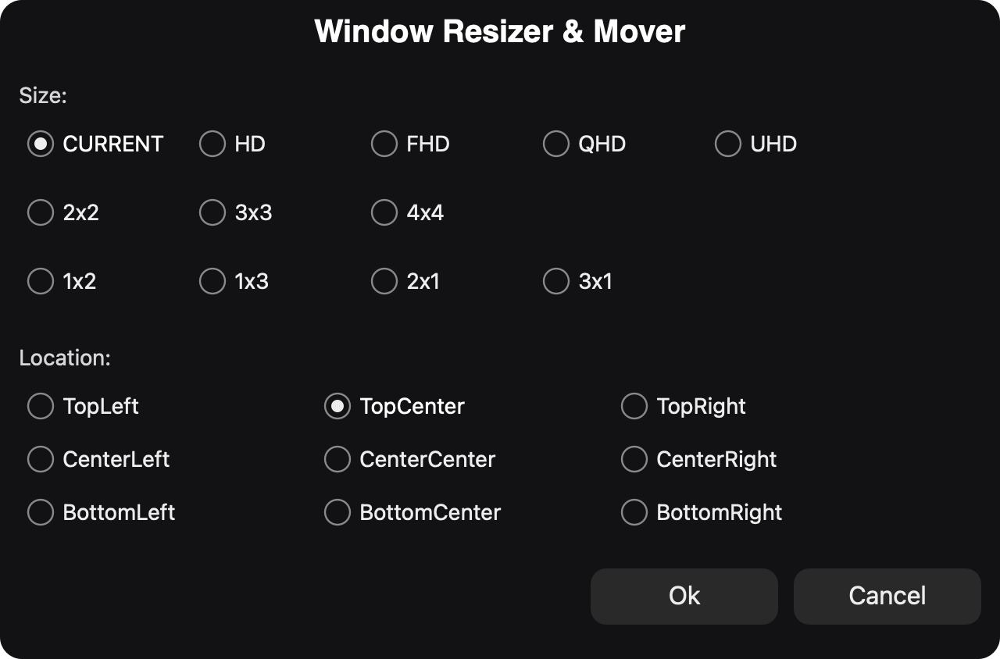
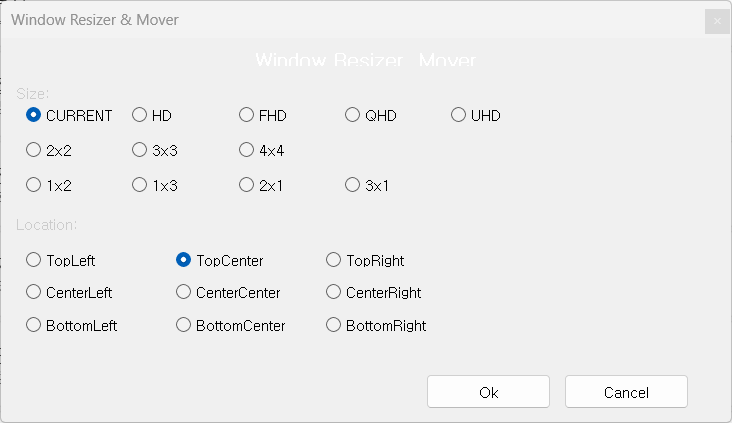

# Window Resizer & Mover

맥과 윈도우에서 창의 크기를 변경하고 위치를 이동시키는 프로그램입니다.

# Mac
## Hammerspoon 사용
- 설치
    - [Hammerspoon 사이트](https://www.hammerspoon.org/)에서 다운로드
    - [Hammerspoon-1.0.0.zip](./mac/Hammerspoon-1.0.0.zip)
- 스크린샷

- 단축키
    - 크기와 위치를 이동할 창을 선택한 후 단축키를 누르면 됩니다.
    - Ctrl + Alt + CMD + B : 팝업 열기
    - CMD + 마우스 왼쪽 버튼 : 팝업 열기
    - CMD + <- : 이전 모니터로 창 이동
    - CMD + -> : 다음 모니터로 창 이동

# Windows 11
## AutoHotkey 사용
- 설치
    - [AutoHotkey 사이트](https://www.autohotkey.com/)에서 v2.x 버전 다운로드
    - [AutoHotkey_2.0.19_setup.exe](./window/AutoHotkey_2.0.19_setup.exe)
- 스크린샷

- 단축키
    - 크기와 위치를 이동할 창을 선택한 후 단축키를 누르면 됩니다.
    - Ctrl + Alt + Win + B : 팝업 열기
    - Ctrl + 마우스 왼쪽 버튼 : 팝업 열기
    - Ctrl + Alt + Win + L : 로그창 열기